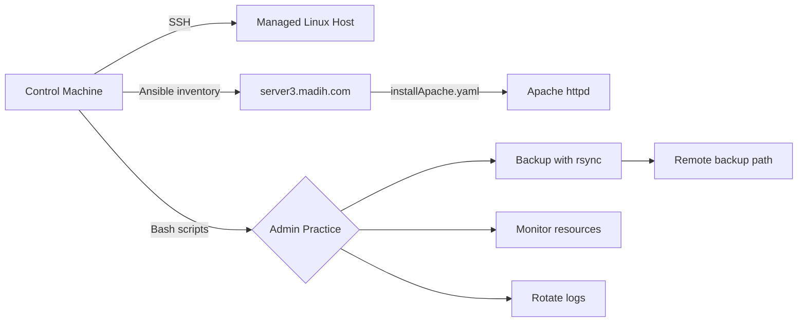

# Linux System Administration and Ansible Lab


This repository is a hands-on Linux system administration lab. It combines Bash scripts and Ansible files used to practice real server tasks such as remote control, Apache installation, backup automation, live monitoring, log rotation, and Ansible role structure.

## Project Overview



## Repository Contents

| Path | Purpose |
| --- | --- |
| `README.md` | Main project documentation |
| `backup.sh` | Backs up `/root/backup` to a remote host with `rsync` and writes `backup.log` |
| `mointor.sh` | Continuously prints time, memory usage, network interface statistics, and process count |
| `logrotaet.sh` | Practice log rotation script for rotating, compressing, and cleaning old logs |
| `hosts.ini` | Ansible inventory for the web server host |
| `installApache.yaml` | Ansible playbook that runs an Apache role on the managed host |
| `roles/cloudkode/` | Ansible role scaffold with Apache package and service tasks |

## Skills Demonstrated

| Area | Skills |
| --- | --- |
| Linux Administration | File systems, permissions, process checks, package installation, service management |
| Bash Scripting | Variables, functions, loops, conditions, command output, log files |
| Remote Management | SSH workflow, remote server access, Git clone on server |
| Backup Automation | `rsync`, remote destination paths, backup logging |
| Monitoring | Memory usage, network statistics, running process count |
| Log Management | Log rotation, compression, cleanup by age |
| Ansible Automation | Inventory files, playbooks, privilege escalation, roles, package and service modules |
| Role Structure | `tasks`, `handlers`, `defaults`, `vars`, `meta`, `files`, `templates`, and `tests` directories |

## Ansible Files

### `hosts.ini`

Defines the managed web host:

```ini
[web]
server3.madih.com ansible_host=192.168.0.104 ansible_user=madih
```

### `installApache.yaml`

Runs against `server3.madih.com` with privilege escalation:

```yaml
---
- name: Install and start apache
  hosts: server3.madih.com
  become: yes

  roles:
    - postname.apache
...
```

Run it with:

```bash
ansible-playbook -i hosts.ini installApache.yaml
```

The playbook currently references the role name `postname.apache`. The repository also contains a local role at `roles/cloudkode/` with tasks that install and start Apache:

- Install the `httpd` package using `ansible.builtin.dnf`
- Start and enable the `httpd` service using `ansible.builtin.service`

If you want the playbook to use the local role, update `installApache.yaml` to reference `cloudkode` instead of `postname.apache`.

## Bash Scripts

### `backup.sh`

Automates a backup from a local source directory to a remote Linux server.

| Setting | Value |
| --- | --- |
| Source directory | `/root/backup` |
| Remote user and host | `madih@192.168.0.103` |
| Remote directory | `/root/` |
| Log file | `backup.log` |

Run it with:

```bash
chmod +x backup.sh
./backup.sh
```

### `mointor.sh`

Runs continuously and prints live system information every 2 seconds:

- Current time
- Memory usage from `free -h`
- Network interface statistics from `ip -s link`
- Number of running processes from `ps -e | wc -l`

Run it with:

```bash
chmod +x mointor.sh
./mointor.sh
```

Stop it with `Ctrl+C`.

### `logrotaet.sh`

Practice script for log rotation and cleanup. Its intended workflow is:

- Scan log files in `/var/log/myapp`
- Rotate large `.log` files
- Compress rotated logs
- Delete old compressed logs after 30 days

Before using this script in a real system, review and test it carefully because it is still a practice script and needs syntax fixes.

## Ansible Role: `roles/cloudkode`

`roles/cloudkode/` is an Ansible role scaffold. Its current task file installs Apache and ensures the service is started and enabled.

| Path | Purpose |
| --- | --- |
| `roles/cloudkode/tasks/main.yml` | Main role tasks |
| `roles/cloudkode/handlers/main.yml` | Handlers triggered by tasks |
| `roles/cloudkode/defaults/main.yml` | Default role variables |
| `roles/cloudkode/vars/main.yml` | Role variables |
| `roles/cloudkode/meta/main.yml` | Role metadata and dependency definitions |
| `roles/cloudkode/files/` | Static files that can be copied by the role |
| `roles/cloudkode/templates/` | Jinja2 templates that can be rendered by the role |
| `roles/cloudkode/tests/test.yml` | Simple role test playbook |
| `roles/cloudkode/tests/inventory` | Local test inventory |
| `roles/cloudkode/README.md` | Role-specific documentation |

Test the role scaffold with:

```bash
ansible-playbook -i roles/cloudkode/tests/inventory roles/cloudkode/tests/test.yml
```

## Basic Workflow

1. Clone the repository on the control machine or Linux server.
2. Review `hosts.ini` and update the host, IP address, or user if needed.
3. Confirm that `installApache.yaml` references the role you want to run.
4. Run the Apache playbook with Ansible.
5. Make the Bash scripts executable.
6. Check script syntax before running.
7. Run the monitoring, backup, or log rotation practice scripts.
8. Review command output and log files.

Example commands:

```bash
git clone <repository-url>
cd <repository-name>

ansible-playbook -i hosts.ini installApache.yaml

chmod +x backup.sh mointor.sh logrotaet.sh
bash -n backup.sh
bash -n mointor.sh
bash -n logrotaet.sh
```

## Project Goal

The goal of this lab is to connect Red Hat administration training with real server practice. The project shows how to write scripts locally, push or clone them to a Linux server, control the server remotely, automate package and service tasks with Ansible, run administration scripts, read results, and improve automation step by step.

## Future Improvements

- Rename `mointor.sh` to `monitor.sh`
- Rename `logrotaet.sh` to `logrotate.sh`
- Fix and test the log rotation script syntax
- Decide whether the Apache playbook should use `postname.apache` or the local `cloudkode` role
- Move hardcoded paths, hosts, and users into configuration variables
- Add stronger error handling to the Bash scripts
- Add cron jobs for scheduled backup and log rotation
- Add systemd service or timer examples
- Replace placeholder metadata in `roles/cloudkode/meta/main.yml`
- Add Ansible checks for firewall rules if Apache should be reachable from other machines
