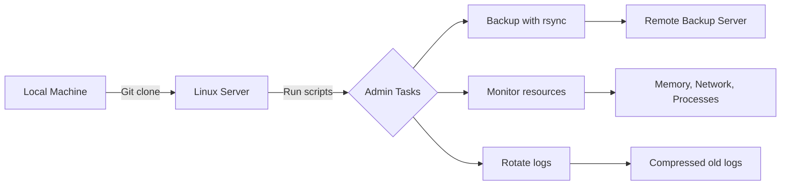
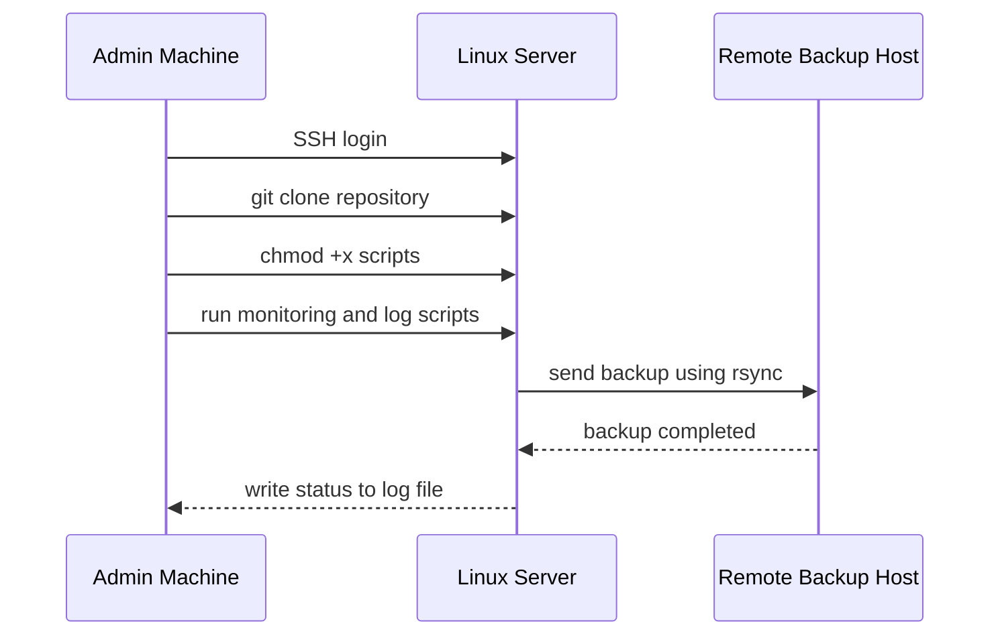

# Linux System Administration Lab


This repository is a hands-on Linux system administration project built after Red Hat system administration training. It contains Bash scripts used to practice real server tasks such as remote control, backup automation, live monitoring, log rotation, and troubleshooting on a virtual or physical Linux server.

## Project Overview



## About Me

I am building practical Linux and Red Hat system administration skills through real command-line projects. This repo shows my ability to prepare Bash scripts, manage servers remotely, move work with Git, and apply automation directly on a Linux environment.

## Skills Demonstrated

| Area | Skills |
| --- | --- |
| Linux Administration | File systems, permissions, process checks, service environment awareness |
| Bash Scripting | Variables, functions, loops, conditions, command output, log files |
| Remote Management | SSH workflow, remote server access, Git clone on server |
| Backup Automation | `rsync`, remote destination paths, backup logging |
| Monitoring | Memory usage, network statistics, running process count |
| Log Management | Log rotation, compression, cleanup by age |
| Troubleshooting | Syntax checking, command testing, reading logs |

## Repository Scripts

| Script | Purpose | Main Commands |
| --- | --- | --- |
| `backup.sh` | Copies backup data to a remote server and records result logs | `rsync`, `date`, redirection |
| `mointor.sh` | Displays live server information every 2 seconds | `free`, `ip`, `ps`, `wc` |
| `logrotaet.sh` | Practice script for rotating and cleaning old logs | `stat`, `mv`, `gzip`, `find` |

## Server Workflow



## Example Usage

Clone the repository on the server:

```bash
git clone <repository-url>
cd <repository-name>
```

Make scripts executable:

```bash
chmod +x backup.sh mointor.sh logrotaet.sh
```

Check syntax before running:

```bash
bash -n backup.sh
bash -n mointor.sh
bash -n logrotaet.sh
```

Run a script:

```bash
./backup.sh
```

## Script Details

### `backup.sh`

Automates backup from a local source directory to a remote Linux server.

- Source directory: `/root/backup`
- Remote user and host: `madih@192.168.0.103`
- Remote directory: `/root/`
- Log file: `backup.log`

### `mointor.sh`

Runs continuously and prints live system information.

- Current time
- Memory usage
- Network interface statistics
- Number of running processes

### `logrotaet.sh`

Practice script for log rotation and cleanup.

- Finds `.log` files
- Renames rotated logs with the current date
- Compresses rotated logs
- Deletes old compressed logs

## Project Goal

The goal of this lab is to connect Red Hat administration training with real server practice. The workflow is to write scripts locally, push or clone them to a Linux server, control the server remotely, run the scripts, read the results, and improve the automation step by step.

## Future Improvements

- Rename scripts to `monitor.sh` and `logrotate.sh`
- Add stronger error handling
- Add configuration variables in a separate file
- Add cron jobs for scheduled backup and log rotation
- Add systemd service or timer examples
- Save monitoring output to a log file

