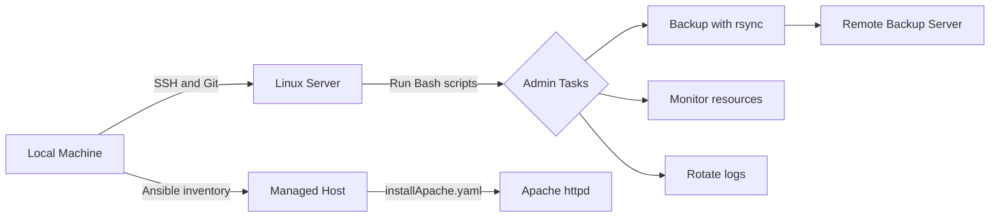

# Linux System Administration and Ansible Lab


This repository is a hands-on Linux system administration lab. It combines Bash scripts and Ansible files used to practice real server tasks such as remote control, Apache installation, backup automation, live monitoring, log rotation, and role scaffolding.

## Project Overview



## Repository Contents

| Path | Purpose |
| --- | --- |
| `README.md` | Main project documentation |
| `backup.sh` | Backs up `/root/backup` to a remote host with `rsync` and writes `backup.log` |
| `mointor.sh` | Continuously prints time, memory usage, network interface statistics, and process count |
| `logrotaet.sh` | Practice log rotation script for rotating, compressing, and cleaning old logs |
| `hosts.ini` | Ansible inventory for the web server host |
| `installApache.yaml` | Ansible playbook that installs, starts, and enables Apache `httpd` |
| `cloudkode/` | Ansible role scaffold for future automation tasks |

## Skills Demonstrated

| Area | Skills |
| --- | --- |
| Linux Administration | File systems, permissions, process checks, service management awareness |
| Bash Scripting | Variables, functions, loops, conditions, command output, log files |
| Remote Management | SSH workflow, remote server access, Git clone on server |
| Backup Automation | `rsync`, remote destination paths, backup logging |
| Monitoring | Memory usage, network statistics, running process count |
| Log Management | Log rotation, compression, cleanup by age |
| Ansible Automation | Inventory files, playbooks, privilege escalation, package and service modules |
| Role Structure | `tasks`, `handlers`, `defaults`, `vars`, `meta`, and `tests` directories |

## Ansible Files

### `hosts.ini`

Defines the managed web host:

```ini
[web]
server.madih.com ansible_host=192.168.0.103 ansible_user=madih
```

### `installApache.yaml`

Runs against `server.madih.com` with privilege escalation and performs two tasks:

- Installs the `httpd` package using `ansible.builtin.dnf`
- Starts and enables the `httpd` service using `ansible.builtin.service`

Run it with:

```bash
ansible-playbook -i hosts.ini installApache.yaml
```

## Bash Scripts

### `backup.sh`

Automates a backup from a local source directory to a remote Linux server.

| Setting | Value |
| --- | --- |
| Source directory | `/root/backup` |
| Remote user and host | `madih@192.168.0.103` |
| Remote directory | `/root/` |
| Log file | `backup.log` |

Run it with:

```bash
chmod +x backup.sh
./backup.sh
```

### `mointor.sh`

Runs continuously and prints live system information every 2 seconds:

- Current time
- Memory usage from `free -h`
- Network interface statistics from `ip -s link`
- Number of running processes from `ps -e | wc -l`

Run it with:

```bash
chmod +x mointor.sh
./mointor.sh
```

Stop it with `Ctrl+C`.

### `logrotaet.sh`

Practice script for log rotation and cleanup. Its intended workflow is:

- Scan log files in `/var/log/myapp`
- Rotate large `.log` files
- Compress rotated logs
- Delete old compressed logs after 30 days

Before using this script in a real system, review and test it carefully because it is still a practice script and needs syntax fixes.

## Ansible Role: `cloudkode`

The `cloudkode` directory is an Ansible role scaffold. It currently contains the standard role layout and placeholder files:

| Path | Purpose |
| --- | --- |
| `cloudkode/tasks/main.yml` | Main role tasks |
| `cloudkode/handlers/main.yml` | Handlers triggered by tasks |
| `cloudkode/defaults/main.yml` | Default role variables |
| `cloudkode/vars/main.yml` | Role variables |
| `cloudkode/meta/main.yml` | Role metadata and dependency definitions |
| `cloudkode/tests/test.yml` | Simple role test playbook |
| `cloudkode/tests/inventory` | Local test inventory |
| `cloudkode/README.md` | Role-specific documentation |

Test the role scaffold with:

```bash
ansible-playbook -i cloudkode/tests/inventory cloudkode/tests/test.yml
```

## Basic Workflow

1. Clone the repository on the Linux server.
2. Review `hosts.ini` and update the host, IP address, or user if needed.
3. Run the Apache playbook with Ansible.
4. Make the Bash scripts executable.
5. Check script syntax before running.
6. Run the monitoring, backup, or log rotation practice scripts.
7. Review command output and log files.

Example commands:

```bash
git clone <repository-url>
cd <repository-name>

ansible-playbook -i hosts.ini installApache.yaml

chmod +x backup.sh mointor.sh logrotaet.sh
bash -n backup.sh
bash -n mointor.sh
bash -n logrotaet.sh
```

## Project Goal

The goal of this lab is to connect Red Hat administration training with real server practice. The project shows how to write scripts locally, push or clone them to a Linux server, control the server remotely, automate package and service tasks with Ansible, run administration scripts, read results, and improve automation step by step.

## Future Improvements

- Rename `mointor.sh` to `monitor.sh`
- Rename `logrotaet.sh` to `logrotate.sh`
- Fix and test the log rotation script syntax
- Move hardcoded paths, hosts, and users into configuration variables
- Add stronger error handling to the Bash scripts
- Add cron jobs for scheduled backup and log rotation
- Add systemd service or timer examples
- Add real tasks and variables to the `cloudkode` Ansible role
- Add Ansible checks for firewall rules if Apache should be reachable from other machines
